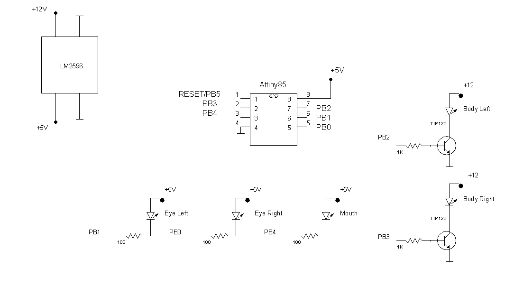

# Spooky

It is Halloween decoration project: image of ghost changing intensity of its 
elements brightness controlled by Attiny85 chip.  Ghost body is presented by 
two LED Flexible Silicone Neon-Like 1 Meter Warm White LED Strips. 
Face elements: eyes an mouth represented by two round semi-circle backlight LED(50mm) modules and one large backlight modul. All these
components can be found at https://www.adafruit.com/.

## Circuit 

Project is powered by 12 V DC power supply (at least 2A output needed). 12 V required 
to power up LED strips. Chip and backlight modules are powered by 5 V which is 
produced out of 12 V by step down power module based on LM2596.
Attiny85 controls backlight LED modules directly. For control of silicone strips there are
 TIP120 Darligtone transistors.

## Programming

Programming was done by Microchip Sudio in C language. 

